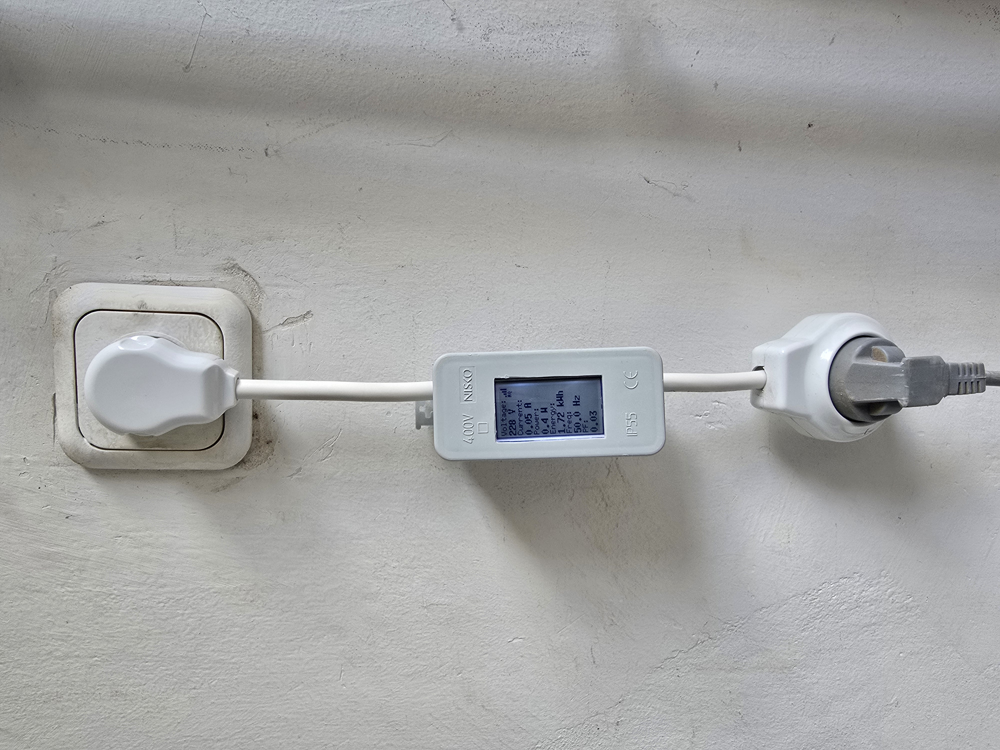
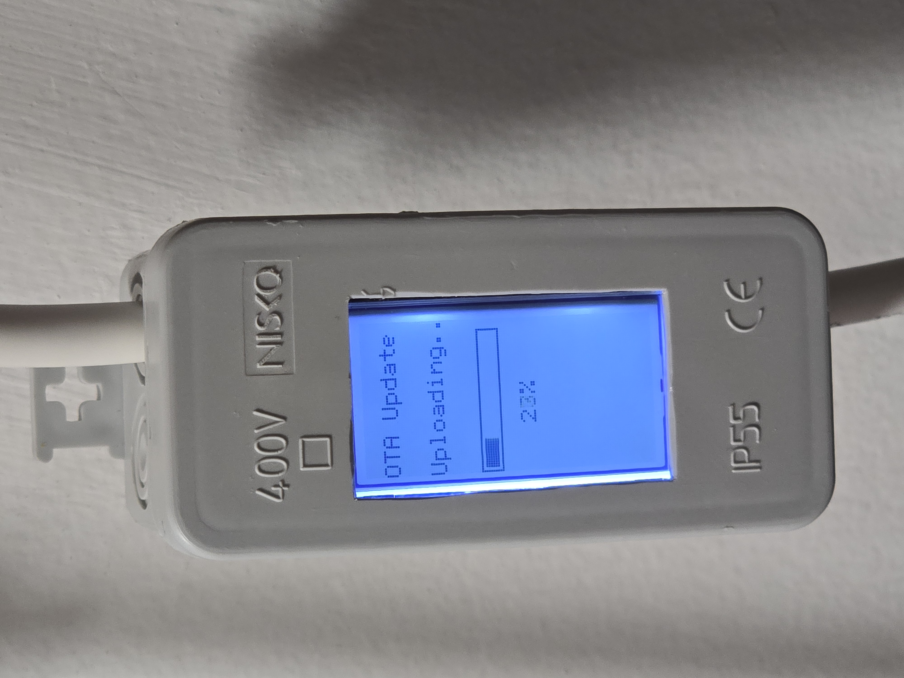
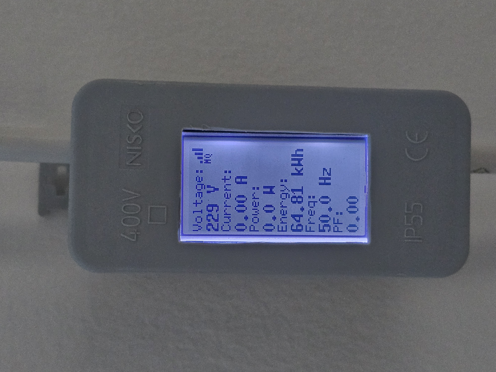
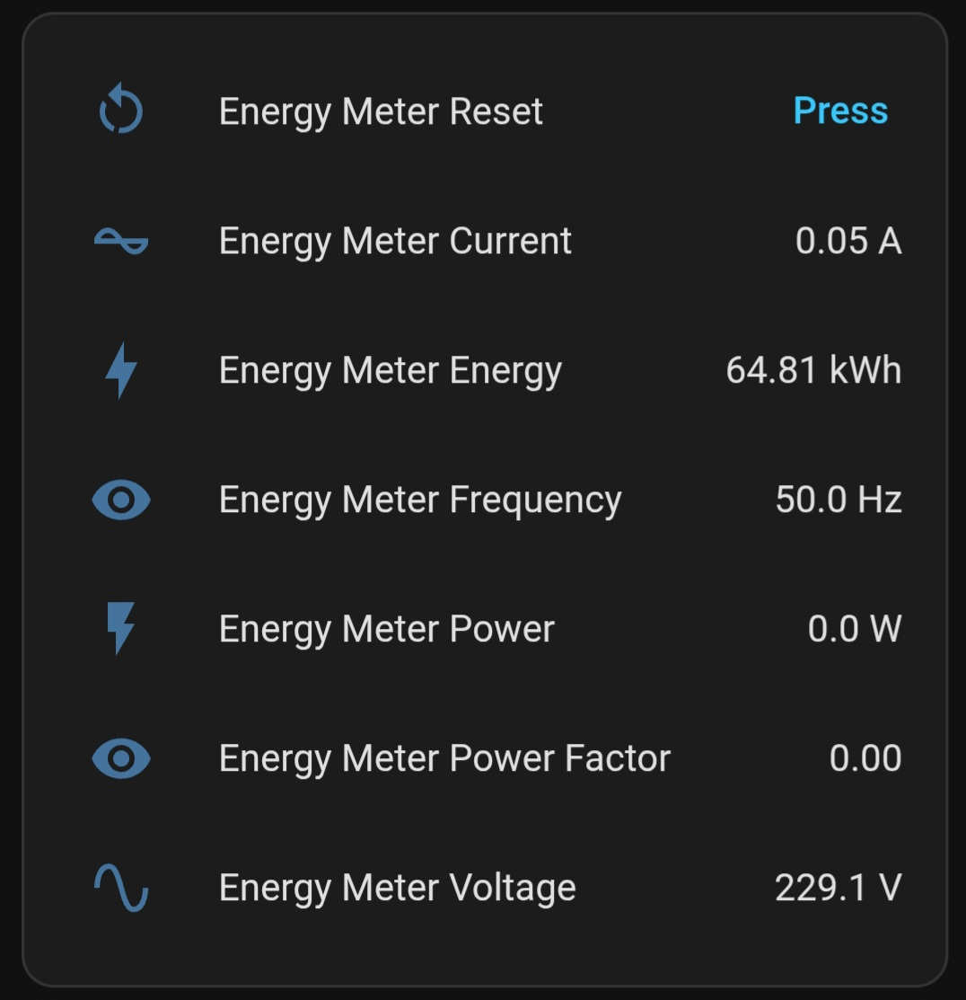
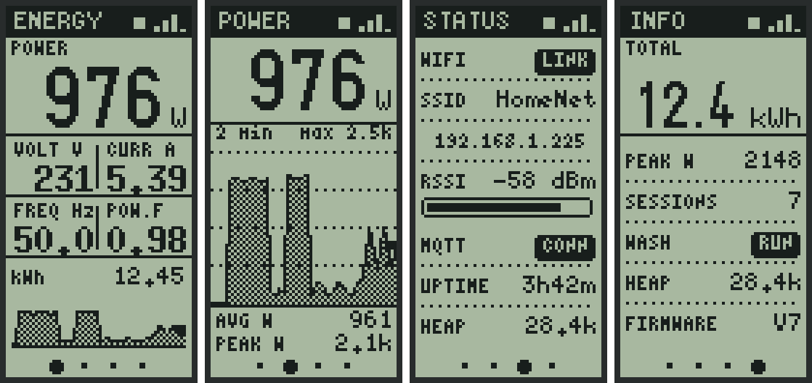
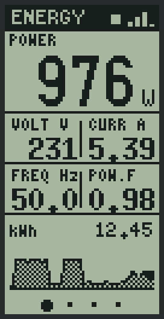
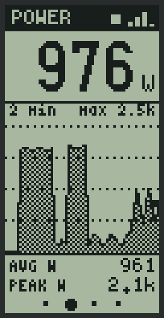
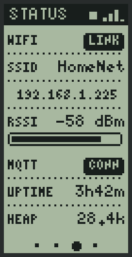
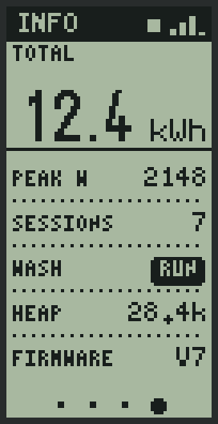

# ESP12F Smart Energy Meter with PZEM-004T V3


Professional AC energy monitoring system with WiFi connectivity, MQTT integration, and Home Assistant support. Monitor voltage, current, power, energy consumption, frequency, and power factor in real-time.



## 📋 Project Overview

This smart energy meter combines an ESP8266 (ESP-12F) microcontroller with a PZEM-004T V3 AC power measurement module to create a comprehensive energy monitoring solution. The device displays real-time electrical parameters on an ST7567 LCD screen and publishes data to Home Assistant via MQTT.

### Key Features
- ⚡ **Real-time AC Monitoring**: Voltage, Current, Power, Energy, Frequency, Power Factor
- 🌐 **Web Management UI**: Built-in web server with tabbed interface — live Status, Sessions history, and editable WiFi / MQTT settings
- 👆 **Touch Screen Navigation**: TTP223 capacitive touch cycles 4 LCD screens (Readings → Power Graph → Status → Info); hold to return to the first screen
- 🧺 **Washing-Session Logging**: Automatically detects appliance cycles by power draw and logs start/end/duration/energy/peak to flash
- 🏠 **Home Assistant Auto-Discovery**: Zero-config device creation, including a "Washing" running sensor and availability (LWT)
- 📊 **ST7567 LCD Display**: 128x64 graphical display with WiFi signal indicator, on-device power graph and an auto-dimming backlight
- 💾 **Persistent Config**: Hostname and MQTT settings stored in LittleFS, editable from the web (no reflash)
- 🕒 **NTP Real-Time Clock**: Accurate timestamps for logged sessions (auto DST)
- 📡 **OTA Firmware Updates**: Update firmware wirelessly over WiFi
- 🔄 **Remote Energy Reset**: Reset energy counter via MQTT command or the web UI
- 📶 **WiFiManager**: Easy first-time WiFi configuration via captive portal
- 🔐 **Password Protected OTA**: Secure firmware updates

## 🎯 Use Cases

- **Home Energy Monitoring**: Track electricity consumption of appliances
- **Server Room Monitoring**: Monitor power usage of network equipment
- **Workshop Power Tracking**: Measure tool and equipment power consumption
- **Solar System Monitoring**: Track energy production and consumption
- **Smart Home Integration**: Integrate with Home Assistant dashboards

## 🛠️ Hardware Requirements

### Components
| Component | Description | Quantity |
|-----------|-------------|----------|
| ESP8266 ESP-12F | WiFi-enabled microcontroller | 1 |
| PZEM-004T V3 | AC power measurement module | 1 |
| ST7567 128x64 LCD | Graphical LCD display (SPI) | 1 |
| Power Supply | 5V for ESP and LCD | 1 |

### PZEM-004T V3 Specifications
- **Voltage**: 80-260V AC
- **Current**: 0-100A
- **Power**: 0-22kW
- **Frequency**: 45-65Hz
- **Energy**: 0-9999.99kWh
- **Accuracy**: ±0.5%
- **Communication**: ModBus RTU (Serial)



### Pinout

#### ESP12F ↔️ PZEM-004T V3
```
ESP12F         PZEM-004T V3
─────────────────────────────
D1 (GPIO5)  →  TX
D2 (GPIO4)  →  RX
5V          →  VCC
GND         →  GND
```

#### ESP12F ↔️ ST7567 LCD (SPI)
```
ESP12F         ST7567 LCD
─────────────────────────────
GPIO0       →  CS (Chip Select)
GPIO2       →  DC (Data/Command)
GPIO16      →  RST (Reset)
CLK (GPIO14)→  SCK (SPI Clock)
MOSI(GPIO13)→  SDA (SPI Data)
D6 (GPIO12) →  LED (Backlight PWM)
3.3V        →  VCC
GND         →  GND
```

#### ESP12F ↔️ TTP223 Touch Sensor
```
ESP12F         TTP223
─────────────────────────────
RX (GPIO3)  →  OUT (idle LOW, touch HIGH)
3.3V        →  VCC
GND         →  GND
```
> ⚠️ GPIO3 is the UART RX pin. Using it for touch disables serial *input*
> (debug prints via TX still work). **Disconnect the sensor before flashing
> over USB** — OTA updates are unaffected. Each touch advances the LCD to the
> next screen.



## 📦 Installation

### 1. Environment Setup
```bash
# Install PlatformIO
pip install platformio

# Clone the project
git clone https://github.com/amir684/ESP12F_PZEM004TV3_EnergyMeter.git
cd ESP12F_PZEM004TV3_EnergyMeter
```

### 2. Install Required Libraries
```bash
pio lib install "U8g2"
pio lib install "PZEM-004Tv30"
pio lib install "PubSubClient"
pio lib install "WiFiManager"
pio lib install "ArduinoOTA"
```

### 3. Configuration

The `#define` values in the sketch are only **initial defaults** used on the very
first boot. Afterwards, the hostname and all MQTT settings are editable from the
**web UI** and stored in LittleFS — no reflash needed to change them.

```cpp
// Network identity (shown in your router; editable via web)
#define DEFAULT_HOSTNAME "EnergyMeter"

// MQTT defaults (first boot only)
#define MQTT_SERVER     "192.168.1.175"  // Your MQTT broker IP
#define MQTT_PORT       1883
#define MQTT_USER       "mqtt_user"      // Your MQTT username
#define MQTT_PASS       "password"       // Your MQTT password
#define MQTT_TOPIC      "home/energy"    // Base topic

// OTA
#define OTA_PASSWORD    "12345678"       // Change this!

// Washing-session detection
#define SESSION_POWER_THRESHOLD 10.0f    // W: above = running
#define SESSION_END_GRACE       300000UL // ms below threshold to end a session (5 min)
#define SESSION_MIN_DURATION    60UL     // s: ignore shorter blips

// NTP (real-time clock for timestamps)
#define NTP_TZ  "IST-2IDT,M3.4.4/26,M10.5.0"  // Israel (change for your timezone)

// LCD Settings
#define LCD_BRIGHTNESS  500              // 0-1023
#define LCD_CONTRAST    20               // 0-63
```

> The build uses a 4MB flash layout with a 2MB LittleFS partition
> (`board_build.ldscript = eagle.flash.4m2m.ld` in `platformio.ini`) to store
> configuration and session logs.

### 4. Compile and Upload
```bash
# Compile
pio run

# Upload to ESP8266
pio run --target upload

# Monitor serial output
pio device monitor
```

### 5. Initial WiFi Setup

1. Power on the device
2. Connect to WiFi AP named **"EnergyMeter-Setup"**
3. Enter your WiFi credentials in the captive portal
4. Device will connect and display its IP address on the LCD

## 🌐 Web Management UI

Open `http://<device-ip>/` (or `http://<hostname>.local/`) in any browser.
The device appears in your router's device list under its configurable hostname.

The interface has four tabs:

| Tab | Purpose |
|-----|---------|
| **Status** | Live readings (V/I/P/E/Hz/PF), WiFi/MQTT/uptime/heap, current wash-session state, and a **Reset Energy Counter** button |
| **Sessions** | Full washing-session history table (date, duration, kWh, peak) with total energy and a **Clear History** button |
| **WiFi** | Connection info + edit the **device name** (router hostname) and switch WiFi network |
| **MQTT** | Edit broker address, port, username, password and base topic — saved to flash and reconnected instantly |

Status data refreshes every 2 seconds via a lightweight JSON API (`/api/status`).

## 🧺 Washing-Session Logging

Purpose-built to log washing-machine (or any appliance) cycles automatically,
with no smart plug required — it uses the measured power draw:

- **Session start**: power rises above `SESSION_POWER_THRESHOLD` (default **10 W**)
- **Session end**: power stays below the threshold continuously for
  `SESSION_END_GRACE` (default **5 min**). The recorded end time is the moment
  power actually dropped — so soak/pause phases mid-cycle don't split a session
  or inflate its duration.
- Sessions shorter than `SESSION_MIN_DURATION` (60 s) are ignored as noise.

Each session records **start, end, duration, energy consumed (kWh), and peak
power**. The last 40 sessions are kept in flash (LittleFS) and survive reboots.
View them in the web **Sessions** tab, and use the Home Assistant
`Washing` sensor to trigger automations like "notify me when the wash is done".

## 🏠 Home Assistant Integration



### Automatic Discovery (recommended)

The device publishes **MQTT auto-discovery** messages under the `homeassistant/`
prefix on every broker connection. As long as the Home Assistant **MQTT
integration** is installed (discovery is on by default), a single device named
after your hostname appears automatically under **Settings → Devices → MQTT**,
with all entities below — **no YAML editing required**.

Auto-created entities:

| Entity | Type | Notes |
|--------|------|-------|
| Voltage / Current / Power / Frequency | sensor | `measurement` |
| Energy | sensor | `total_increasing` (works with the Energy Dashboard) |
| Power Factor | sensor | `power_factor` |
| **Washing** | binary_sensor | `running` — ON while an appliance cycle is active |
| **Session Energy** | sensor | energy of the current / last session (kWh) |

A **Last Will (LWT)** on `home/energy/status` marks all entities *unavailable* if
the device goes offline.

### MQTT Topics

The device publishes to the following topics (base topic `home/energy` is configurable):

| Topic | Description | Unit | Update Rate |
|-------|-------------|------|-------------|
| `home/energy/voltage` | AC Voltage | V | 5 seconds |
| `home/energy/current` | Current draw | A | 5 seconds |
| `home/energy/power` | Active power | W | 5 seconds |
| `home/energy/energy` | Cumulative energy | kWh | 5 seconds |
| `home/energy/frequency` | AC Frequency | Hz | 5 seconds |
| `home/energy/pf` | Power factor | - | 5 seconds |
| `home/energy/session` | Washing running (`ON`/`OFF`) | - | 5 seconds |
| `home/energy/session_energy` | Current/last session energy | kWh | 5 seconds |
| `home/energy/status` | Availability (`online`/`offline`, LWT) | - | On connect |
| `home/energy/reset_status` | Reset command status | - | On demand |

### Remote Energy Reset

Send "RESET" to topic `home/energy/reset` to reset the energy counter:

```bash
mosquitto_pub -h localhost -t "home/energy/reset" -m "RESET"
```

The device will respond with "SUCCESS" or "FAILED" on `home/energy/reset_status`.

### Manual YAML Configuration (optional)

Only needed if you have MQTT discovery disabled — otherwise the entities above
are created automatically.

```yaml
mqtt:
  sensor:
    - name: "Energy Meter Voltage"
      state_topic: "home/energy/voltage"
      unit_of_measurement: "V"
      device_class: voltage
      state_class: measurement

    - name: "Energy Meter Current"
      state_topic: "home/energy/current"
      unit_of_measurement: "A"
      device_class: current
      state_class: measurement

    - name: "Energy Meter Power"
      state_topic: "home/energy/power"
      unit_of_measurement: "W"
      device_class: power
      state_class: measurement

    - name: "Energy Meter Energy"
      state_topic: "home/energy/energy"
      unit_of_measurement: "kWh"
      device_class: energy
      state_class: total_increasing

    - name: "Energy Meter Frequency"
      state_topic: "home/energy/frequency"
      unit_of_measurement: "Hz"
      state_class: measurement

    - name: "Energy Meter Power Factor"
      state_topic: "home/energy/pf"
      state_class: measurement

  button:
    - name: "Energy Meter Reset"
      command_topic: "home/energy/reset"
      payload_press: "RESET"
```

## 🎨 LCD Display

The panel is a 128x64 ST7567 mounted in portrait (`U8G2_R3`), giving a 64x128
canvas. All four screens share one header, one set of type styles and a page
indicator along the bottom.



> These are renders, not photographs: the firmware's drawing code was replayed
> on the host against the real u8g2 font data, so they are pixel-accurate to
> what the panel shows.

### 1. Main readings



Live power as the headline figure — the font scales itself to the largest size
that fits, so a three-digit reading is set larger than a four-digit one. Below
it, voltage, current, frequency and power factor sit in a 2x2 grid, then the
cumulative kWh, then a sparkline of the last two minutes.

### 2. Power graph



Two minutes of history, one sample per pixel column, newest on the right. The
filled area sits under a solid trace with a marker on the current sample.

The Y axis rounds up to the next value on a 1/1.2/1.5/2/2.5/3/4/5/6/8 ladder
rather than a plain 1/2/5 one, which keeps the trace filling the plot instead of
leaving half of it empty; the chosen ceiling is printed top right. Average and
peak across the window are shown underneath.

### 3. Status



Link state, SSID, IP address, signal strength as both a figure and a bar, broker
state, uptime and free heap.

### 4. Info



Cumulative energy as the headline figure, plus peak power seen, logged session
count, whether a wash is running, free heap and firmware version.

### Touch behaviour

| Gesture | Action |
|---------|--------|
| Tap | Next screen, with a slide transition |
| Hold (0.8 s) | Jump straight back to the main screen |
| Tap while dimmed | Wakes the backlight only, without changing screen |

The backlight fades down to a dim level after 60 seconds without a touch and
comes straight back on the next one. Adjust via `LCD_DIM_LEVEL` and
`LCD_DIM_TIMEOUT`.

## 🔧 OTA Updates

### Update Firmware Over WiFi

1. Find device IP address (shown on LCD or in the router / web UI)
2. Open Arduino IDE → Tools → Port → Network Port
3. Select your device by its hostname (default "EnergyMeter") at `[IP_ADDRESS]`
4. Enter password: `12345678`
5. Upload new firmware

### Using PlatformIO

```bash
pio run --target upload --upload-port [IP_ADDRESS]
```

## 📊 Technical Details

### Power Consumption
- **ESP8266**: ~80mA (WiFi active)
- **LCD**: ~30mA (backlight on)
- **PZEM-004T**: ~20mA
- **Total**: ~130mA @ 5V (≈0.65W)

### Measurement Accuracy
- **Voltage**: ±0.5%
- **Current**: ±0.5% (>0.1A)
- **Power**: ±0.5%
- **Energy**: ±1%

### Update Intervals
- **LCD Refresh**: 2 seconds
- **MQTT Publish**: 5 seconds
- **Web Status API**: 2 seconds
- **Session Detection**: evaluated every reading (non-blocking loop)

## 🔧 Troubleshooting

### WiFi Connection Issues
1. ✅ Hold reset button to restart captive portal
2. ✅ Check WiFi credentials are correct
3. ✅ Ensure 2.4GHz WiFi network (ESP8266 doesn't support 5GHz)
4. ✅ Check router DHCP settings

### PZEM Not Reading
1. ✅ Verify TX/RX connections (crossed: ESP TX → PZEM RX)
2. ✅ Check PZEM power supply (5V)
3. ✅ Ensure AC load is connected
4. ✅ Test with serial monitor for PZEM responses

### LCD Not Displaying
1. ✅ Check SPI pin connections
2. ✅ Adjust contrast value (LCD_CONTRAST)
3. ✅ Verify backlight PWM connection (D6)
4. ✅ Check 3.3V power supply

### MQTT Not Connecting
1. ✅ Verify MQTT broker IP and port
2. ✅ Check username and password
3. ✅ Ensure MQTT broker is running
4. ✅ Check firewall rules
5. ✅ Monitor serial output for connection errors

### OTA Update Fails
1. ✅ Verify correct password
2. ✅ Ensure device and computer are on same network
3. ✅ Check available flash memory
4. ✅ Disable firewall temporarily

## 📈 Future Enhancements

- [x] MQTT Auto-Discovery for Home Assistant
- [x] Web interface for configuration
- [x] Session logging to flash (LittleFS)
- [x] Touch-screen navigation with on-device graph
- [ ] Cost calculation based on electricity rate
- [ ] CSV export of session history
- [ ] Daily/monthly energy statistics
- [ ] Power limit alerts
- [ ] Multi-channel support (multiple PZEM sensors)
- [ ] Grafana dashboard integration

## 📄 License

This project is licensed under the Apache License 2.0 - see the [LICENSE](LICENSE) file for details.

## 🤝 Contributing

Pull Requests are welcome! Please open an Issue first for major changes.

## 📞 Contact

- **GitHub**: [@amir684](https://github.com/amir684)
- **Email**: amir684684@gmail.com

## 🙏 Acknowledgments

- **PZEM-004T Library** - Jakub Mandula
- **U8g2 Library** - olikraus
- **PubSubClient** - Nick O'Leary
- **WiFiManager** - tzapu
- **Home Assistant** - Open Home Foundation

---

**⚠️ Safety Warning**:
- This device works with AC mains voltage (up to 260V)
- Only install if you are qualified to work with mains electricity
- Always disconnect power before making connections
- Use appropriate safety equipment and procedures
- Improper installation can cause electric shock, fire, or death
- When in doubt, consult a licensed electrician

**Made with ❤️ for Smart Home Enthusiasts**
